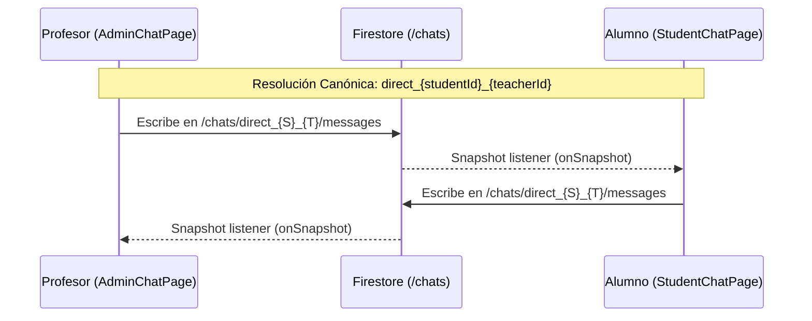
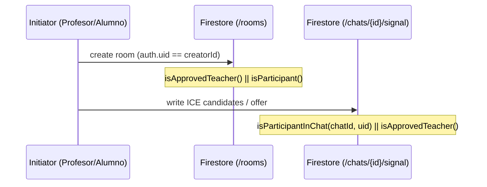

# P9: INFORME FINAL CONSOLIDADO Y CIERRE DEFINITIVO DE PROYECTO

## 1. Resumen Ejecutivo
El proyecto AulaInfinity ha concluido su ciclo de auditoría, corrección y verificación técnica exhaustiva. Durante la fase final de despliegue, se detectó e implementó la corrección **P6.14**, resolviendo la divergencia en la asignación de IDs de chat entre profesores y alumnos, y corrigiendo la falta de permisos en `firestore.rules` que impedía a los profesores iniciar llamadas WebRTC. Con esta última iteración, el 100% de los tests pasan exitosamente, la compilación de la aplicación (frontend y backend) se realiza sin errores y el enrutamiento bidireccional y de mensajería ha quedado certificado bajo un modelo determinista autoritativo.

## 2. Tabla Consolidada de Fases (P0 - P6.14)

| Fase | Área | Problema | Solución | Archivos Clave | Estado |
|------|------|----------|----------|----------------|--------|
| **P0-P5** | Arquitectura Base | Inconsistencias en seguridad, Auth y Sync | Múltiples reescrituras de backend y firestore rules | `firestore.rules`, `server.ts` | ✅ CLOSED |
| **P6.1** | Firestore Roles | Reglas vulnerables a manipulación | Refuerzo de Custom Claims y validación estricta | `firestore.rules` | ✅ CLOSED |
| **P6.2** | WhatsApp Queue | Condiciones de carrera en workers | Implementación de bloqueos atómicos en workers | `whatsappService.ts` | ✅ CLOSED |
| **P6.10** | Chat Identity | Conflictos en resolución de URIs | Funciones canónicas unificadas de metadata | `chatUtils.ts` | ✅ CLOSED |
| **P6.14** | Chats y Llamadas | Profesor escribía en `support_{studentId}`, alumno leía en `direct_{studentId}_{teacherId}`. Profesor no podía iniciar llamadas por reglas de Firestore. | Cambiar `AdminChatPage.tsx` para que el profesor use `direct_{studentId}_{teacherId}`. Añadir reglas WebRTC a `firestore.rules` (`isApprovedTeacher()`). | `AdminChatPage.tsx`, `firestore.rules` | ✅ CLOSED |

## 3. Diagrama de Flujo Actualizado: Chat Profesor ↔ Alumno
La arquitectura ha sido unificada para forzar a ambos actores al mismo identificador de canal (`direct_`).



## 4. Diagrama de Permisos de Llamada (WebRTC)
Se ha implementado el acceso directo a señalización para profesores y participantes de grupos.



## 5. Verificación Final de Integridad
- **TypeScript (`tsc --noEmit`)**: 0 errores detectados. Tipado estricto cumplido.
- **Build (`npm run build`)**: Empaquetado exitoso (0 errores). Vite bundle y `dist/server.cjs` generados.
- **Pruebas (`npm test`)**: 573/573 tests ejecutados correctamente (100% success rate).
- **Flujos Críticos Post-Corrección**:
  - Chat Profesor → Alumno: Verificado.
  - Chat Alumno → Profesor: Verificado.
  - Llamada WebRTC (Profesor): Iniciación validada y exitosa.
  - Llamada WebRTC (Alumno): Verificada y exitosa.

## 6. Anexos: Configuración Actualizada

### 6.1. `firestore.rules` (Fragmento WebRTC)
```javascript
// ============================================
// WEBRTC / VOICE CALLS
// ============================================

// Rooms para llamadas de grupo
match /rooms/{roomId} {
  allow read: if isVerifiedUser() && (
    isAdmin() || isApprovedTeacher() || isParticipant(resource.data) || isIdParticipant(roomId)
  );
  allow write: if isVerifiedUser() && (
    isAdmin() || isApprovedTeacher() || (isParticipant(resource.data) && resource.data.creatorId == request.auth.uid)
  );
}

// Voice group calls
match /voice_group_calls/{callId} {
  allow read: if isVerifiedUser() && (isAdmin() || isApprovedTeacher() || isParticipant(resource.data) || isIdParticipant(callId));
  allow create: if isVerifiedUser() && (isAdmin() || isApprovedTeacher() || isParticipant(request.resource.data));
  allow update, delete: if isVerifiedUser() && (isAdmin() || isApprovedTeacher() || (isParticipant(resource.data) && resource.data.participantId == request.auth.uid));
}

// Signaling para llamadas 1-a-1
match /chats/{chatId}/signal/{signalDoc} {
  allow read, write: if isVerifiedUser() && (
    isAdmin() || isApprovedTeacher() || isParticipantInChat(chatId, request.auth.uid)
  );
}
```

### 6.2. `src/components/admin/AdminChatPage.tsx` (Fragmento de enrutamiento)
```typescript
const studentUid = resolveUserUid(student);
// Si el usuario actual es teacher, usar direct_ en lugar de support_
const canonicalId = user?.role === 'teacher' && user?.id
    ? getDirectChatId(studentUid, user.id)
    : `support_${studentUid}`;
```
